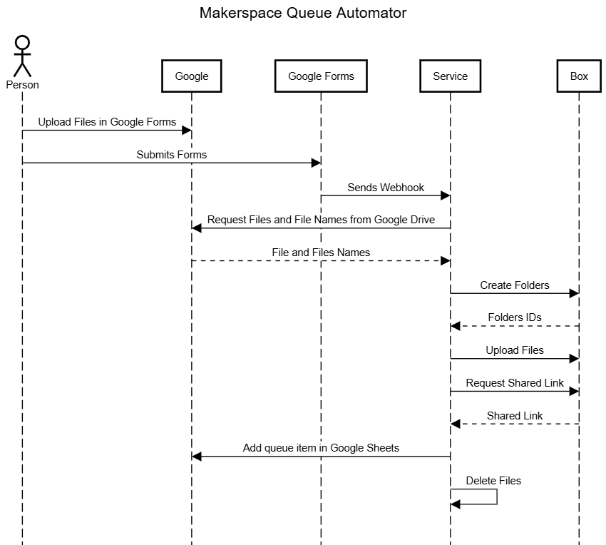

# MakerspaceQueue
Queue Automator for BYU HBLL Makerspace

http://35.153.196.169
https://queue.hbllmakerspace.click/



## First Set Up
### Pre-reqs
**Local Machine**
1. node.js
2. `git clone` repo
3. `npm install`
4. AWS instance key (you should be able to find the file in the login info doc)

### Adding secret keys
1. Create `.env` file in project directory
2. In the `.env` file there should be these keys:
```
BOX_CLIENT_ID=
BOX_CLIENT_SECRET=
GAPI_CLIENT_ID=
GAPI_CLIENT_SECRET=
```
3. Fill the GAPI keys
    1. Go to [Google Cloud console](https://console.cloud.google.com/) with the Makerspace gmail
    2. Go to the `Queue Automator` Project's `API & Services` page and navigate to `Credentials`
    3. Under `OAuth 2.0 Client IDs`, get the client ID and client secret from the existing ID with the type "Web application"
    4. Paste them in the `.env` file accordingly
4. Fill Box Api keys (Assuming the person in charge of this project left)
    1. Go to [Box Developer console](https://byu.app.box.com/developers/console) using an account that has access to the Makerspace folders in Box (e.g. someone who works in the Makerspace).
    2. Create a Platform App
    3. Choose Custom App
    4. Fill in info and **select __User Authentication (OAuth 2.0)__**
    5. In the Configuration page for the app, under OAuth 2.0 Redirect URIs, add `http://localhost:3000/box` and `https://queue.hbllmakerspace.click/box`
    6. In the same page, under Application Scopes, check `Write all files and folders stored in Box`
    7. In the same page, under CORS Domains, add `http://localhost:3000/, https://queue.hbllmakerspace.click/`
    8. Now in the same page, under OAuth 2.0 Credentials, copy the Client ID and Client Secret
    9. Paste them in the `.env` file accordingly

### Deploying to server
1. Run `./deployService.sh -k [~/AWSInstanceKey.pem] -h [yourdomain.com] -s [appname]` ex. `./deployService.sh -k ~/.ssh/AWSQueueAutomator.pem -h 35.153.196.169 -s queue-automator`

### First Authentication
1. Go to the [Queue Automator Panel](https://queue.hbllmakerspace.click/)
2. Click on Box Login **with an account with access to the Makerspace folders in Box**
3. Click on Google Login **with the Makerspace Google account**

Test if it's working by submitting an item through the google forms

## Google Sheet queue columns changed?
1. In `sheets-stuff.js`, modify the function `convertToCells`, you should see an if statement with arrays. Find the correct queue that changed and modify that array, each element in the array represents a cell for a row and modify accordingly.
2. Run `./deployService.sh -k [~/AWSInstanceKey.pem] -h [yourdomain.com] -s [appname]` ex. `./deployService.sh -k ~/.ssh/AWSQueueAutomator.pem -h 35.153.196.169 -s queue-automator`
3. Go to the [Queue Automator Panel](https://queue.hbllmakerspace.click/)
4. Click on Box Login **with an account with access to the Makerspace folders in Box**
5. Click on Google Login **with the Makerspace Google account**

Test if it's working by submitting an item through the google forms

## Debugging
### Demo Google Forms webhook response data
```
{
    "First Name": "yooyoyoo",
    "Last Name": "susususuusp",
    "Email": "yo@sup.das",
    "Service": "3D Print",
    "Files": [
        "1mqIUCYhmr1RkdndzKpFx1HhNLmPCjEsV"
    ],
    "Academic": "Yes",
    "Type": "FDM",
    "Specific Requests": "yoyooyoyosuususupp"
}
```
### Demo request data for service
```
curl -H "Content-Type: application/json" -X POST -d '{ "First Name": "yooyoyoo", "Last Name": "susususuusp", "Email": "yo@sup.das", "Service": "3D Print", "Files": [ "1lGXReSVCs6jvTclGKeJpb1qNZBMXxA1H" ], "Academic": "Yes", "Type": "FDM", "Specific Requests": "yoyooyoyosuususupp" }' http://localhost:3000/data
```

## To do:
- [x] Setup server
- [x] Receive webhook from google froms
- [x] Modify google sheets | [Docs](https://github.com/jpillora/node-google-sheets)
    - [x] Setup google api OAuth
- [x] Upload folders to Box | [Docs](https://github.com/box/box-typescript-sdk-gen/tree/main)
    - [x] Setup Box OAuth
- ~~[ ] Send email from outlook~~